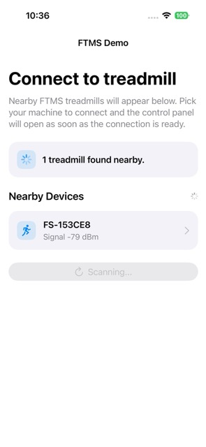
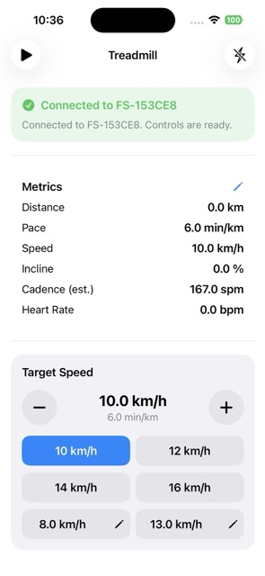

# FTMS Demo

`FTMS Demo` is an iOS demo app that tests the capabilities of the Bluetooth FTMS (Fitness Machine Service) protocol with treadmills.

The app is focused on validating end-to-end FTMS communication:
- Discover nearby FTMS treadmills over Bluetooth
- Connect to a selected treadmill
- Read live treadmill telemetry (distance, pace, speed, incline, cadence estimate, heart rate)
- Send control commands such as start/stop and target speed updates

## Why this project exists

This project is a practical testbed for FTMS behavior on real devices.  
It helps validate scanning, connection reliability, characteristic parsing, and command flow before building a production-grade treadmill controller.

## Screenshots

| Connection flow      | Connected dashboard |
| ----------- | ----------- |
|       |        |
